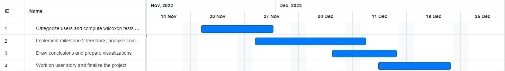

# Defying the Brain's Divisions: How Artistic and Scientific Interests Overlap on YouTube
Web story: https://katesedykh.github.io/ada-project-website/
## Table of contents:
- [Defying the Brain's Divisions: How Artistic and Scientific Interests Overlap on YouTube](#defying-the-brain-division)
  - [Table of contents:](#table-of-contents)
  - [1. Abstract](#1-abstract)
  - [2. Research Questions](#2-research-questions)
  - [3 Tools](#3-tools)
    - [3.1 Proposed additional datasets (if any)](#31-proposed-additional-datasets-if-any)
    - [3.2 Methods](#32-methods)
      - [Constraints](#constraints)
      - [Milestone 2](#milestone-2)
      - [Next tasks](#next-tasks)
  - [4 Organization](#4-organization)
    - [4.1 Timeline](#41-timeline)
    - [4.2 Team organization](#42-team-organization)
  - [Questions for TAs (optional)](#questions-for-tas-optional)


## 1. Abstract
We are often put into boxes regarding our interests and hobbies, we have friends with the same interests as us, we chose a department when we are young at high school and social media makes a lot of suggestions based on our past interests. We sometimes hear that artistic and scientific people are different, closed-minded in their subject, and not interested in the other one. As an example, there exists a popular myth according to which "left-brained" people are more logical whereas "right-brained" people are more creative.


The goal of this project is to study this stereotype by studying the YouNiverse dataset at our disposition using comments and video metadata files. We want to determine whether users who usually comment on artistic videos also comment on scientific videos (and vice-versa). Our goal is also to split artistic and scientific videos into smaller domains to analyze if this effect is influenced by the particular domain of science/art in which the user is interested. To draw some conclusions about people’s interests, we can determine the user profiles and the watching/commenting behaviors w.r.t. videos that do not usually match their profiles.


## 2. Research Questions
- How do we define art in YouTube?
- What type of art (visual, literary, performing) and sciences (technical, theoretical) are the most popular?
- Are commenters interested only in one area or are they engaged in both artistic and scientific videos?
- Is there a difference of cross-interest between science and art when we study domains of these fields?
- What is the difference in terms of artistic sensibility between people interested in technical-related science vs people interested in natural sciences?

## 3 Tools
External libraries:
```
pandas, numpy, matplotlib, seaborn, scipy, wordcloud, matplotlib_venn, networkx
```

### 3.1 Proposed additional datasets (if any)

None.

### 3.2 Methods

#### Constraints  
1.  Keep only around 600 000 users and the videos on which they commented.
2.  Our artistic videos are split into three domains: visual art, literary art, and performing art.
3.  Our scientific videos are split into two domains: technical sciences, and natural sciences.

#### Milestone 2
1.  Prepare a dataset with 600 000 users and the videos on which they commented.
2.  Select only relevant features.
3.  EDA of the videos.
4.  EDA of the comments.
5.  Define a dictionary to select visual art, literary art, and performing art videos.
6.  Define a dictionary to select technical sciences and theoretical sciences videos.
7.  Use keyword matching between these dictionaries and the videos to classify them.
8.  EDA of the artistic and scientific videos.

EDA: Exploratory Data Analysis

#### Milestone 3
1. Update of word dictionaries for keyword matching using GPT3 and ChatGPT.
2. Further EDA of the sampled users that commented videos.
3. Visualize users in a bipartite network graph and projections to highlight interesting cross-domain interactions.
4. Linear regression to study likelihood to comment on a video belonging to a certain domain (e.g. visual arts) based on commenting habits of videos of the other categories (e.g natural science and technical science).
5. Multiple statistical tests: T-test, Wilcoxon test, Welch's t-test and Mann-Whitney U test.

## 4 Organization
### 4.1 Timeline
* 21 November – 27 November: Categorize users and compute statistical tests and linear regression
* 28 November – 4 December: Implement milestone 2 feedback, analyze combinations of users and domains 
* 5 December – 11 December: Draw conclusions and prepare visualizations
* 12 December – 23 December: Work on the data story and finalize the project


  
### 4.2 Team organization

Kelyan: Artistic EDA, Scientific EDA, Comments EDA, Users EDA, Visualisation with Bipartite Graphs, Statistical Analysis, Writing Data Story

Gaston: Data Sampling and Preprocessing, Videos EDA, Statistical Analysis, Linear Regression, Writing and Themes/Illustration for Data Story

Sushen: Video EDA, Scientific EDA, Artistic EDA, Dictionaries update, Bipartite Graphs, Writing Data Story

Ekaterina: Scientific EDA, Artistic EDA, Writing Data Story, Managing Github Pages website and formatting Data Story
